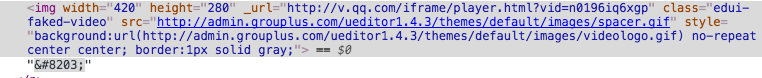

# 百度视频导入图片转iframe

## 1. 需求

需求是这样的.

原本百度编辑器导入视频后,会变成这个球样

其实这样的话,优势就是可以修改,如果直接显示iframe,如果想修改,只能重来了

不过这样显示一张图片,的确怪怪的,各有好处吧

## 2.思路

思路应该挺简单,找到往编辑器插入这个图片的那个点,换一下就OK

看一下输出的img是啥

思路还好,把width height _url抓出来就好了

## 3. 看源码啊

真心,看了这么多插件,这个编辑器的代码写的真心不错..

瞄了几瞄

就能找到在哪生成这个img的啦

