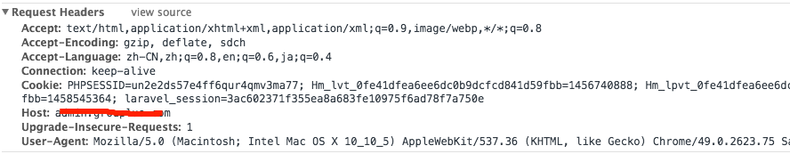

# 常见知识

#1. 匿名函数及其作用域

```php
<?php
$message = 'hello';

// 没有 "use"
$example = function () {
    var_dump($message);
};
echo $example(); //NULL

// 继承 $message
$example = function () use ($message) {
    var_dump($message);
};
echo $example(); //string(5) "hello"

// Inherited variable's value is from when the function
// is defined, not when called
// 在函数定义时就确定了,后续改无用
$message = 'world';
echo $example(); //string(5) "hello"

// Reset message
$message = 'hello';

// Inherit by-reference
// 重新定义方法,参数用指针.
$example = function () use (&$message) {
    var_dump($message);
};
echo $example(); //string(5) "hello"

// The changed value in the parent scope
// is reflected inside the function call
// 因为用了指针,后续更改有用
$message = 'world';
echo $example(); //string(5) "world"

// Closures can also accept regular arguments
// 还可以在匿名函数中自定义参数,和从父作用域中共同使用.
$example = function ($arg) use ($message) {
    var_dump($arg . ' ' . $message);
};
$example("hello"); //string(11) "hello world"
?>
```

参考链接<http://php.net/manual/zh/functions.anonymous.php>

#2. 获取子类的类名

<http://www.php-note.com/article/detail/874>

#3. 递归爆栈 错误提示

    Allowed memory size of 134217728 bytes exhausted (tried to allocate 72 bytes) i

来个不限制内存的设置...

程序中设置`ini_set('memory_limit', '-1');`

或者到php.ini中设置

#4. 根据变量获取类名

```php
get_class($base_Model);
//返回 "命名空间\Patient_Model"
```

#5. 配置本地域名

修改apache配置文件`/etc/apache/httpd.conf`

启动虚拟主机加载,去掉#

```
# Virtual hosts
Include /private/etc/apache2/extra/httpd-vhosts.conf
```

然后修改`extra/httpd-vhosts`

不过笔者改了以后没在vhotst声明的之前的项目都无法访问了.

还会有403权限问题.我把整个项目都777以后,才可以访问.

#6. 获取php中定义的所有页面

问题是这样的:我Laravel后台传输给前台很多变量,我需要获取所有值.

`get_defined_vars()`可以获取页面的所有变量.

#7. HTTP_ORIGIN什么时候存在

最近在PHP调用`$_SERVER['HTTP_ORIGIN']`,发现有时会有,有时不会

默认什么时候有,一般的ajax访问都会有


而如果是直接的页面跳转或资源访问



#8. list

```php
<?php

$info = array('coffee', 'brown', 'caffeine');

// Listing all the variables
list($drink, $color, $power) = $info;
echo "$drink is $color and $power makes it special.\n";

// Listing some of them
list($drink, , $power) = $info;
echo "$drink has $power.\n";

// Or let's skip to only the third one
list( , , $power) = $info;
echo "I need $power!\n";

// list() doesn't work with strings
list($bar) = "abcde";
var_dump($bar); // NULL
?>
```

#9. preg_replace_callback的应用

先给下最终代码

```php
    public function getModelInfo($url,$method,$urlParams, $params = []){

        if(!empty($urlParams)) {
            $index = 0;
            preg_replace_callback('(:\w+)',function($matches) use ($urlParams) {
                foreach( $urlParams as $key => $value) {
                    return $urlParams[$index++];
                }
            },$url);

        }
        return $this->http_client->$method($url);
    }
```

url是类似` "/v1/official/info/:info_id/weight/:weight";`这样的字符串

