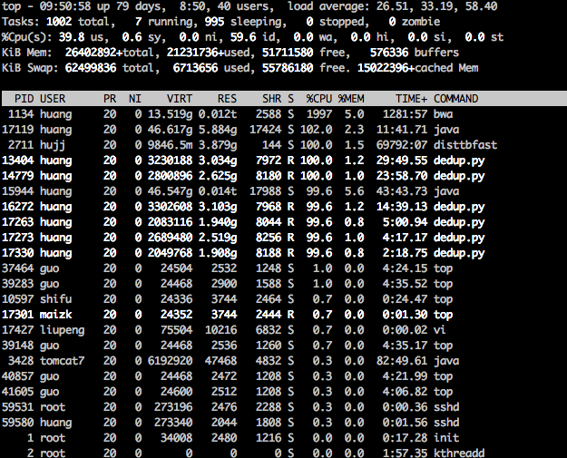

# Common

##1.Write failed: Broken pipe

`ssh`一段时间后不操作,会出现如题错误.

1. 个人机配置

    创建`./.ssh/config`文件
    
    ```shell
    ServerAliveInterval 60
    ```
    
2. or 服务器配置

    `/etc/ssh/sshd_config`
    
    ```shell
    ClientAliveInterval 60
    ```
    
参考链接<http://www.cnblogs.com/dudu/archive/2013/02/07/ssh-write-failed-broken-pipe.html>

##2. 服务器性能检测命令

参考<http://www.ha97.com/837.html>


1. uptime : 查看系统运行时间 登陆窗口数,等待CPU处理的进程数(最佳为1)

    
2. top 显示CPU的运行状态

    
