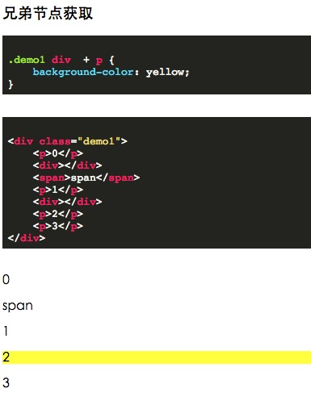
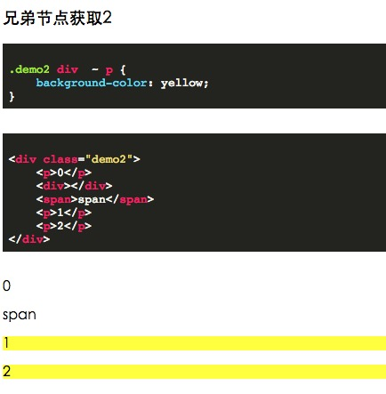
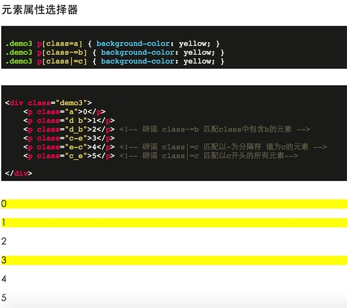
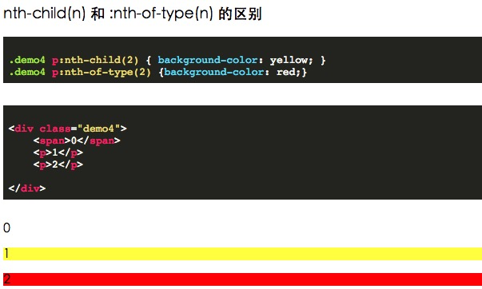

# CSS选择器 

### CSS选择器简述

| 选择器 | demo | demo描述 | CSS |
| --- | --- | --- | --- |
| .class |.hide|选择class值含有用空格分隔后有hide值的元素|1 |
| #id |#my_id|选择id属性为my_id的元素|1 |
| * |* |匹配所以元素|2 |
| element | p | 匹配所有p标签|1 |
| element,element|div,p|匹配所有div元素和p元素|1 |
| element element|div p|匹配div子孙元素里所有的p标签|1 |
| element>element|div>p|匹配div子元素里所有的p标签|2 |
| element+element|div+p|匹配div后面兄弟元素紧贴着的p元素|2 |
| element~element|div~p|匹配div后面兄弟元素所有的p元素|3|

属性选择器

|选择器|demo|demo描述|CSS |
| --- | --- | --- | --- |
|[attr]|[tagert]|匹配所有含有target属性的元素|2|
|[attr=val]|[target=_blank]|匹配含有target值为_blank的元素|2|
|[attr~=val]|[class=a]|匹配所有class值以空格为分隔符分隔后值含有a的元素|2|
|[attr^=val]|[href^=https]|匹配href以https开头的元素|3|
|[attr$=val]|[href$=.pdf]|匹配href以.pdf结尾的元素|3|
|[attr*=val]|[href*=xxx.com]|匹配href包含xunlei.com的元素|3|
|[attr&brvbar;=val]|[langth&brvbar;=en]|匹配lang属以en-开头的元素|2|

tips: &brvbar; 实为 `|`, 因为gitbook生成html时这里有问题 所以这里需要做下替换

伪类选择器

|选择器|demo|demo描述|CSS|
| --- | --- | --- | --- |
|:link|a:link|匹配所有未被访问过的链接|1|
|:visited|a:visited|匹配所有已被访问的链接|1|
|:active|p:active|匹配鼠标按下去的p标签|1|
|:hover|p:hover|匹配鼠标hover的p标签|1|
|:focus|p:focus|匹配获取焦点的p标签元素|1|

tips:

一般就表单元素和链接才会用有焦点.但是只要元素有tabindex属性就可以触发focus

|选择器|demo|demo描述|CSS|
| --- | --- | --- | --- |
|:first-letter|p:first-letter|匹配p元素的首字母|1|
|:first-line|p:first-line|匹配p元素的首行|1|

|选择器|demo|demo描述|CSS|
| --- | --- | --- | --- |
|:first-child|p:first-child|匹配父元素的第一个元素并且要为p元素|2|
|:only-child|p:only-child|匹配父元素仅有一个子元素并且要为p元素|3|
|:nth-child(n)|p:nth-child(n)|匹配父元素的第n个元素并且要为p元素|3|
|:nth-last-child(n)|p:nth-last-child(n)|匹配父元素的倒数第n个元素并且要为p元素|3|
|:last-child|p:last-child|匹配父元素的最后一个元素并且要为p元素|3|

|选择器|demo|demo描述|CSS|
| --- | --- | --- | --- |
|:first-of-type|p:first-of-type|匹配父元素的第一个p元素|3|
|:last-of-tyoe|p:last-of-type|匹配父元素的最后一个p元素|3|
|:nth-of-type(n)|p:nth-of-type(n)|匹配父元素的第n个p元素|3|
|:nth-last-of-type(n)|p:nth-last-of-type(n)|匹配父元素的倒数第n个p元素|3|

|选择器|demo|demo描述|CSS|
| --- | --- | --- | --- |
|:root|:root|匹配文档的根元素, 一般就是html元素|3|
|:before|p:before|在p标签之前插入内容|2|
|:after|p:after|在p标签之后插入内容|2|
|:empty|p:empty|匹配没有子元素(包括文本节点)的p元素|3|
|:enabled|input:enabled|匹配enabled的input元素|3|
|:disabled|input:disabled|匹配disabled的input元素|3|
|:checked|input:checked|匹配被选中的的input元素|3|
|:not(selector)|:not(p)|匹配非p的元素|3|
|:target|:target|匹配当前页面的瞄点元素|3|
|::selection|::selection|匹配被用户选择的元素|3|


### element + element 选择器

假设匹配 规则为 div + p

则可理解为 匹配 `<div>`元素后紧接的p元素

具体demo可见: http://demo.404mzk.com/css/selector/



- 数字1的`<p>` 因为和前面的`<div>`相隔了一个`<span>` 所以无法匹配到
- 数字3的`<p>` 因为不是和`<div>`紧贴着 所以也无法匹配到 
- 数字2的`<p>` 成功匹配

此规则属于CSS2

tips:

有些网站 老是把 `element + element` 这个规则解释为

`选择紧接在 <div> 元素之后的所有 <p> 元素。`

明显是有歧义的

### element1 ~ element2 选择器

这个兄弟选择器就比较好懂了 就是匹配 element1 后面的兄弟选择器 element2



在线体验demo: http://demo.404mzk.com/css/selector/index.html#demo2

### element ~= element 和 element |= element

- [attr~=var]: 以空格分隔attr属性 有值等于var
- [attr|=var] : 匹配attr 为var-开头的元素



在线体验demo: http://demo.404mzk.com/css/selector/index.html#demo3

### :nth-child(n) 和 :nth-of-type(n) 的区别

- :nth-child(n): 匹配的是 父元素的第n个元素
- :nth-of-type(n) 匹配的是 父元素 同类型的第n个元素

在线体验demo: http://demo.404mzk.com/css/selector/index.html#demo4



这里提个问题

假设css匹配改为

```css
.demo4 :nth-child(2) { background-color: yellow; }
.demo4 :nth-of-type(2) {background-color: red;}
```

即不要:前面的p 那么匹配到的元素是否一样?

其实是一样的

因为 :nth-child(2) 只要父元素有两个元素 就可以匹配上...

而:nth-of-type(2) 只要父元素有两个同类型的元素 就可以匹配上


