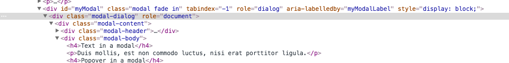

# CSS

##1.高度100%,铺满屏幕问题

需求是我想点击提交后,会出现一层遮掩层,遮掩层铺满整个屏幕.

宽度方面简单设置`width:100%`即可

但是高度设置`height:100%`,是不起作用的,容器的高度仍为容器内容的高度

网页的高度会怎么算

1. 百分比设置参照父元素;
2. 元素默认的高度为height:auto;

那么现在想实现一个遮掩层达到高度100%

###方法一 : 设定父级高度
做法可以有`html-body-我的div`都设置成100%.

但是这样的做法不太优雅,因为要影响html和body的高度设置

缺点:
1. 但是这样就不允许`margin`和`padding`了,因为会出现滚动条

###方法二 : javascript实现

我觉得这里用`javascript`获取屏幕高度设置给div可能会比较好

缺点

1. 出现了遮掩层后,变化浏览器尺寸时,高度100%是无法根据拖动情况而改变的.
2. 

###方法三: `fixed`和 0(最后采用)

因为想起了`Bootstrap`,也有个添加遮掩层,然后在上面加`Modal`的做法,所以就看了看代码<http://getbootstrap.com/javascript/#live-demo>

大致层次为



可以查看到主要分三层,`modal`->`modal-dialog`

```css
.model{
    position: fixed;
    top: 0;
    right: 0;
    left: 0;
    bottom: 0;
    z-index: 1050;
}
```

参考:<http://www.webhek.com/css-100-percent-height>

##2. 垂直居中

这个问题,大概有100种解决方式

###方法一: 绝对定位+top+left+margin

```css
.element {
    width: 600px; height: 400px;
    position: absolute; left: 50%; top: 50%;
    margin-top: -200px;    /* 高度的一半 */
    margin-left: -300px;    /* 宽度的一半 */
}
```

缺点很明显 需要固定好高宽,才能算出margin

###方法二: 绝对定位+top+left+transform

```css
.element {
    position: absolute; left: 50%; top: 50%;
    transform: translate(-50%, -50%);    /* 50%为自身尺寸的一半 */
}

`translate`偏移的百分比是根据容器自身的`width`和``
```

###方法三:绝对定位+各方向0+margin

```css
.element {
    position: absolute; left: 0; top: 0; right: 0; bottom: 0;
    margin: auto;    /* 有了这个就自动居中了 */
}
```

这应该是应用最广的了,因为各方向都要求0px,各方向都会去拉这个内容框,所以最终他们能拉的距离是平分的.然后各方向拉内容区域,只能在`margin`上,所以margin要设为`auto`才方便各个方向去拉内容区域.

参考链接<http://www.zhangxinxu.com/wordpress/2013/11/margin-auto-absolute-%E7%BB%9D%E5%AF%B9%E5%AE%9A%E4%BD%8D-%E6%B0%B4%E5%B9%B3%E5%9E%82%E7%9B%B4%E5%B1%85%E4%B8%AD/>

###4. 外边框合并问题

