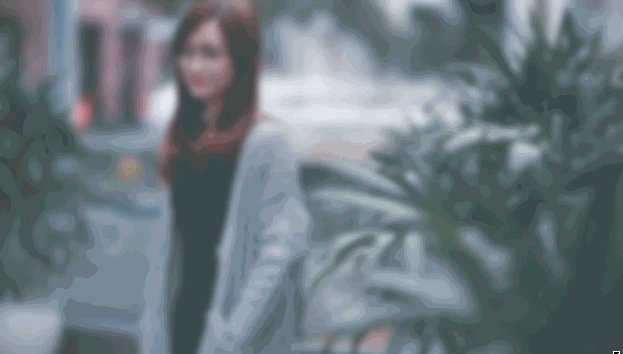

# 高斯模糊+图片缩放

# 1. 效果

我想实现的是满屏高斯模糊 + 图片自动居中显示 + 不缩放




# 2. 图片缩放

是在背景图片的基础下实现100%显示不缩放的

```scss
  background:  url('Image/login.jpg') top center/cover no-repeat ;
```

# 3. 关于高斯模糊

网上基本有css的blur和canvas实现

但是blur的实现方法

```scss
    -webkit-filter: blur(30px);
    -moz-filter: blur(30px);
    -ms-filter: blur(30px);
    filter: blur(30px);
    filter:progid:DXImageTransform.Microsoft.Blur(PixelRadius=30, MakeShadow=false);
```

是不会对背景图片进行缩放的

但是如果用img标签的话,现在还不清楚如何在img中实现这样的100%不缩放效果.所以这里的高斯模糊是用ps实现的.......后续会探讨