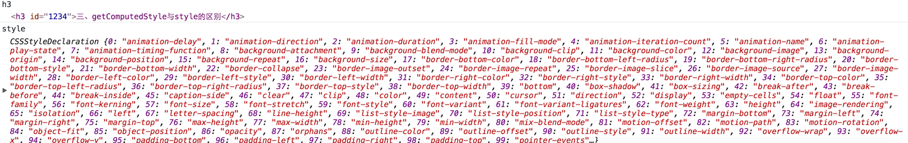

# getComputedStyle

## 1. 简介

作用: 获取指定dom的所有css属性

语法: `var style = window.getComputedStyle("元素", "伪类"|null);`

eg: 

```javascript
var h3 = document.getElementById("1234"),
  style = window.getComputedStyle(h3,null)
```

output:



## 2. getComputedStyle与style区别

1. getComputedStyle只读,而style可读可写
2. getComputedStyle把所有CSS都列出来(包括未设置的),而style只列举设置了的
3. getComputedStyle.length表示浏览器支持的CSS属性个数,而style.length为0

## 3.兼容

兼容IE6~8

```javascript
elementStyle = (element.currentStyle? element.currentStyle : window.getComputedStyle(element, null)));
```

但是坑还是好多IE专属的currentStyle和其他浏览器的getComputedStyle属性命名都有很多差异...

## 参考链接

<http://www.zhangxinxu.com/wordpress/2012/05/getcomputedstyle-js-getpropertyvalue-currentstyle/>