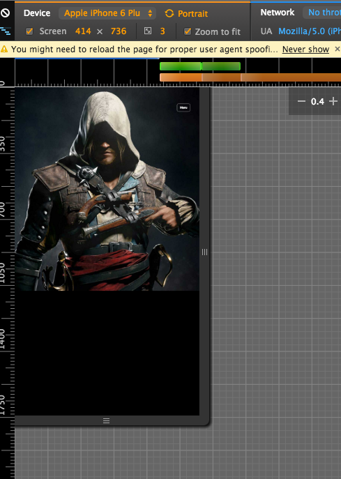

# HTML

HTML5 实现

1. `data-` : 
2. `insertAdjacenHTML` : 
3. `用户选取文本`
4. 数组方法

##1. 移动端自动缩放问题

参考文章

1. <https://github.com/riskers/blog/issues/17>
2. <https://github.com/riskers/blog/issues/18>

问题是这样的在PC端显示

但是在移动端就会

问题出在哪?.移动端的自动缩放

因为移动端的浏览器比较贪心.你啥都没设置的话,他们会尽可能的在手机上显示所有内容..

所需我在头部中设置`<meta name="viewport" content="width=device-width,initial-scale=1">`

解释一下`width=device-width`是什么意思