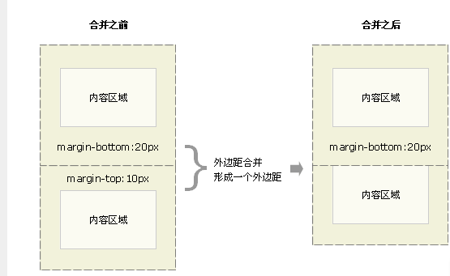
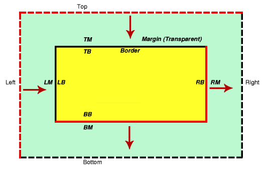

# 基本

#1.高度100%,铺满屏幕问题

需求是我想点击提交后,会出现一层遮掩层,遮掩层铺满整个屏幕.

宽度方面简单设置`width:100%`即可

但是高度设置`height:100%`,是不起作用的,容器的高度仍为容器内容的高度

网页的高度会怎么算

1. 百分比设置参照父元素;
2. 元素默认的高度为height:auto;

那么现在想实现一个遮掩层达到高度100%

##方法一 : 设定父级高度
做法可以有`html-body-我的div`都设置成100%.

但是这样的做法不太优雅,因为要影响html和body的高度设置

缺点:
1. 但是这样就不允许`margin`和`padding`了,因为会出现滚动条

##方法二 : javascript实现

我觉得这里用`javascript`获取屏幕高度设置给div可能会比较好

缺点

1. 出现了遮掩层后,变化浏览器尺寸时,高度100%是无法根据拖动情况而改变的.
2. 

###方法三: `fixed`和 0(最后采用)

因为想起了`Bootstrap`,也有个添加遮掩层,然后在上面加`Modal`的做法,所以就看了看代码<http://getbootstrap.com/javascript/#live-demo>

大致层次为


可以查看到主要分三层,`modal`->`modal-dialog`

```css
.model{
    position: fixed;
    top: 0;
    right: 0;
    left: 0;
    bottom: 0;
    z-index: 1050;
}
```

参考:<http://www.webhek.com/css-100-percent-height>

#2. 垂直居中

这个问题,大概有100种解决方式

##方法一: 绝对定位+top+left+margin

```css
.element {
    width: 600px; height: 400px;
    position: absolute; left: 50%; top: 50%;
    margin-top: -200px;    /* 高度的一半 */
    margin-left: -300px;    /* 宽度的一半 */
}
```

缺点很明显 需要固定好高宽,才能算出margin

##方法二: 绝对定位+top+left+transform

```css
.element {
    position: absolute; left: 50%; top: 50%;
    transform: translate(-50%, -50%);    /* 50%为自身尺寸的一半 */
}

`translate`偏移的百分比是根据容器自身的`width`和``
```

##方法三:绝对定位+各方向0+margin

```css
.element {
    position: absolute; left: 0; top: 0; right: 0; bottom: 0;
    margin: auto;    /* 有了这个就自动居中了 */
}
```

这应该是应用最广的了,因为各方向都要求0px,各方向都会去拉这个内容框,所以最终他们能拉的距离是平分的.然后各方向拉内容区域,只能在`margin`上,所以margin要设为`auto`才方便各个方向去拉内容区域.

参考链接<http://www.zhangxinxu.com/wordpress/2013/11/margin-auto-absolute-%E7%BB%9D%E5%AF%B9%E5%AE%9A%E4%BD%8D-%E6%B0%B4%E5%B9%B3%E5%9E%82%E7%9B%B4%E5%B1%85%E4%B8%AD/>

#3. Margin合并问题

外边框合并: 当`普通文档流`中的`垂直`方向发生两个元素的margin区域重合,就会发生外边框`合并`.两个margin最后形成一个margin,值为原先margin大的值,`行边框`,`浮动框`,`绝对定位`不会发生外边框合并.


margin合并主要有3种情况

1. 一个元素的`margin-bottom`和`margin-top`合并
    
2. 一个元素包含另外一个元素,然后两个元素有重叠情况
    
    记住哦,只有垂直方向的margin会合并,margin-left/right是不会合并的.这种情况可以给父元素加个border或padding或者内容.
3. 一个空元素,无padding和border,只有margin
    

解决方法:页面只设定单向`Margin`.

参考链接<http://www.w3school.com.cn/css/css_margin_collapsing.asp>

###5. Margin对待元素的差别

Margin对待的元素主要有三种

1. 块状元素:`P|H1|H2|H3|H4|H5|H6|UL|OL|PRE| DL | DIV | NOSCRIPT | BLOCKQUOTE | FORM | HR | TABLE | FIELDSET | ADDRESS`.<https://developer.mozilla.org/zh-CN/docs/Web/HTML/Block-level_elements>
    
    Margin`top/right/bootom/left`皆可用
2. 不可置换内联元素:`#PCDATA（即文本）| TT | I | B | BIG | SMALL|EM | STRONG | DFN | CODE |SAMP | KBD | VAR | CITE | ABBR | ACRONYM|A | OBJECT | BR | SCRIPT | MAP | Q | SUB | SUP | SPAN | BDO`

    `margin-top/bottom`不起作用.`margin-left/right`起作用
3. 可置换内联元素:`IMG|INPUT|SELECT|TEXTAREA|BUTTON|LABEL`

    Margin`top/right/bootom/left`皆可用

###6. 负Margin的应用

要玩负Margin,必须先了解Margin参考线



当`margin`4个值都为正时,Margin的计算方向就如红色线那样隔开.

以上只是Margin为正的情况,当Margin则会相反.

Margin参考线和参考物分两类

1. Top和Left,都是从外往内容推距离,以自身为参考物
2. Right和Bottom,都是内容框内往外推距离.以临近元素为参考物.例如`margin-bottom`为-10px时,会把临近的下方元素给提上来10px

参考链接<http://www.hicss.net/i-know-you-do-not-know-the-negative-margin/>

###7. 移动端自动缩放

如果直接没兼容移动端的网页在手机上打开,会放大/缩小页面,以达到和PC端的浏览效果类似,下面语句阻止浏览器放大/缩小界面

```html
 <meta name="viewport" content="width=device-width,initial-scale=1">
```

###8. CSS实现正方形

最后我采用的是

padding-bottom实现,因为padding算百分比是根据父元素的宽度计算的

所以只要width和padding-bottom设置为一样的百分比,就能实现正方形

更具体可以参考

<https://idiotwu.me/css-responsive-square/>

###9.. 背景图片永远居中

横向滚动条不会出现,窗口显示的是最中间的图形

```css
background: no-repeat center top url("../Image/Index/index.jpg");
```
