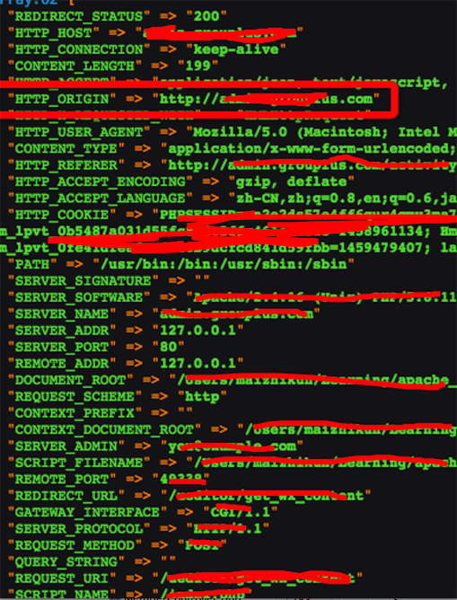

# 浏览器对HTTP_ORIGIN的差异性及其作用

## 1.问题

为了在PHP中获取到当前访问网页的域名,采用了`$_SERVER['HTTP_ORIGIN']`

但是后续出现了BUG,显示`Undefined index: HTTP_ORIGIN`

这个问题的原因在于,浏览器是否发送`HTTP_ORIGIN`

## 2.浏览器差异

在Chrome中测试当浏览器发送ajax的POST请求时,`$_SERVER`会存储哪些HTTP信息头

而当FireFox执行相同的操作时

`$_SERVER`会返回什么

这个FireFox并没有返回HTTP_ORIGIN

## 3. HTTP_ORIGIN作用

`HTTP_ORIGIN`主要是用来防止CSRF(跨域)攻击的(当然其实这并没什么卵用,header头是可以伪造的)

但是当Firefox包括其他的一些浏览器,会自行判断,当请求的域名和现在网站的域名一致时,不发送ORIGIN

## 4. 解决方式

用`HTTP_HOST`代替,这个`HTTP_HOST`是基本所有浏览器都会返回的信息头,所以用`$Server['HTTP_HOST']`来获取域名,会比较可靠一点.
