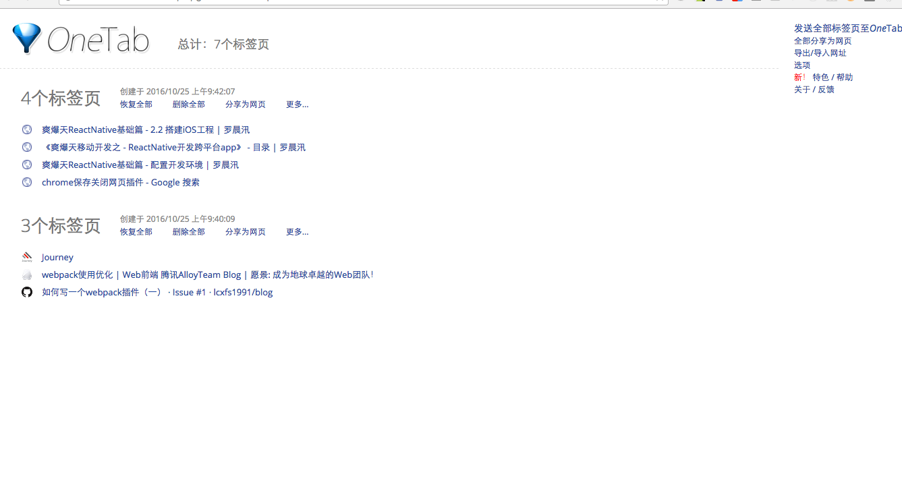

# Mac常用插件

# 1. 一键保存当前打开所有的标签页面

该插件是Chrome的

> 情景

我要做A事情: 关于A事情打开了一个Tab,这个Tab我又有很多的网页,这些网页是关于A事情的

但是我现在要做B事情,所以先把A最小化,然后新开一个Tab专门放事情B的网页

但是这样事情多了以后,Chrome会耗很多内存

OneTab

安装地址: https://www.one-tab.com/