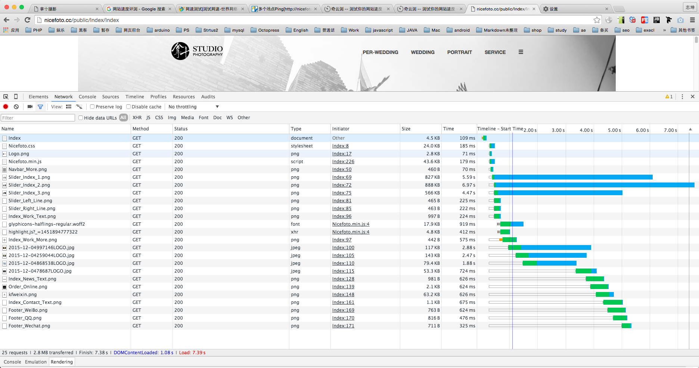

# Nicefoto.cc优化

<http://nicefoto.cc/>



首页加载图中,有3张轮播图,还有其他固定小图片,耗时比较明显,还有加载的时候是先白屏然后由上往下的加载,效果非常恶心.

先安利一下Chrome如何实现不同手机设备和网络环境,和各个浏览器的调试


##1. CSS Sprite

最基本和最有用的技巧.

<http://www.cn.spritegen.website-performance.org/>

先把需要的图片放进去,然后里面会有css/less导出,再用相应的class放到图片的位置上.

##2. 轮播图加载

至于轮播,当网页load完才加载其他照片

有个小技巧,一次次`append`js访问DOM会慢,把内容放在变量里,一次`append`
```javascript
window.onload = function(){
    var lazy_loading_html = '<div class="item"> </div>';
    lazy_loading_html += '<div class="item"> </div>';
    $("#lazy_loading").append(lazy_loading_html);
}
```