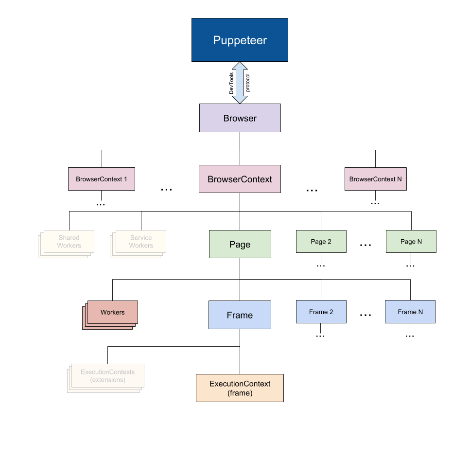

# Puppeteer 简介 

# 简述

Puppeteer是一个Node库, 提供了基于devtools协议上的高级API, 用于操控Chrome或Chromium

Puppeteer 建立于 chrome 能headless运行+ chromedevtools协议 

chromedevtools协议 https://chromedevtools.github.io/devtools-protocol/

命令行启动 无头模式 并开始 remote

```bash
chrome --headless --remote-debugging-port=9222 https://chromium.org
```

chromedevtools 其实好早就有了 但是headless 是2017年 chrome 59才支持的

而说了 Puppeteer 是devtools协议上的高级API

当然也有底层的devtools协议的库 例如 https://github.com/cyrus-and/chrome-remote-interface 这里不多做介绍

# 作用

- 集成测试
- 繁琐的浏览器任务
- 爬虫
- 性能

# 选型参考

|技术方案名称|性能|开发友好性|隐蔽性|实现方案|
|--|--|--|
|puppeteer|低|较好|高|chromedevtools协议|
|纯后端|高|中|低|纯HTTP|
|phantomJs|低|中等|高|QtWebKit实现headless|
|SeleniumHQ|低|差|高|浏览器本身原生API|


# 集成测试 

建议集成测试 可以配合 jest+pupputeer 来进行集成测试

可以先按https://jestjs.io/docs/en/puppeteer 的这个文档进行 配置 

具体案例可见

```javascript
let page

beforeAll(async () => {
    page = await global.__BROWSER__.newPage()
    await page.goto('http://m.pay.xxx.com/vippay/xxx.html')
})

it(' test W4 下单', async () => {
    expect.assertions(1)
    
    await page.click('.j_payway_tab[data-key=old_payway_w4]')

    return new Promise(resolve => {
        page.on('response', async (response) => {
            if ( response.url().indexOf('https://xxxxxxx.com/payorder/v3/Order') !== -1){
                let responseJson = await response.json()
                expect(responseJson.data.orderId.length > 0).toBe(true)
                resolve()
            }
        })
    })
})
```

然后执行jest 即可进行集成测试

很多开发 不要认为测试只是测试的事

每个开发都应该争取在同等单位的开发时间内, 能少更多的bug

# 源码分析

大致框架 

图片来源 https://github.com/GoogleChrome/puppeteer/



其主要代码目录结构为

```bash
.
├── Errors.js
├── index.js // puppeteer 主入口
├── install.js // 安装 Chromium核
└── lib/
    ├── Accessibility.js // 可访问性API 类
    ├── Browser.js // 浏览器管理类
    ├── BrowserFetcher.js //拉取chromium核操作
    ├── Connection.js // 管理 WebSocket/Pipe 传输库 及 针对devtools-protocol 兼容
    ├── Coverage.js // css和js 的总量和已执行量
    ├── DOMWorld.js // 实现操作DOM
    ├── DeviceDescriptors.js // 枚举 大多数手机的 宽高信息 
    ├── Dialog.js // alert, beforeunload, confirm or prompt 这些dialog的实例
    ├── EmulationManager.js
    ├── Errors.js // 切换浏览器展示页面的设备 类似 chrome调试wap设备的视图
    ├── Events.js // 枚举 发布订阅的 事件名
    ├── ExecutionContext.js
    ├── FrameManager.js // 管理frame 包括主frame
    ├── Input.js // 键盘 鼠标 实现类
    ├── JSHandle.js // 页面里的对象类
    ├── Launcher.js // 入口 启动 内核类
    ├── LifecycleWatcher.js // 生命周期监听
    ├── Multimap.js // 辅助类 管理map对象
    ├── NetworkManager.js // network 的事件
    ├── Page.js // 最重要的类 基本都通过Page与 其他数据对象进行交互 
    ├── PipeTransport.js // Pipe传输库 
    ├── Puppeteer.js
    ├── Target.js // 可理解为浏览器下的每个页面 target类
    ├── TaskQueue.js // 队列处理异步任务
    ├── TimeoutSettings.js // 超时设置类
    ├── Tracing.js // 性能日志的收集 下载下来显示在chrome-performance中
    ├── USKeyboardLayout.js // 枚举每个按键的信息 例如  'Control': {'keyCode': 17, 'key': 'Control', 'code': 'ControlLeft', 'location': 1},
    ├── WebSocketTransport.js // WebSocket 传输库
    ├── Worker.js // Woroker 管理类 
    ├── api.js // 简单罗列所有class对象 方便hook async 报错时 能 new Error错误栈
    └── helper.js // 辅助类
```

# 代码小技巧

> node方法promise化

```javascript
promisify(nodeFunction) {
    function promisified(...args) {
      return new Promise((resolve, reject) => {
        function callback(err, ...result) {
          if (err)
            return reject(err);
          if (result.length === 1)
            return resolve(result[0]);
          return resolve(result);
        }
        nodeFunction.call(null, ...args, callback);
      });
    }
    return promisified;
  }
```

> eventEmitterPromise化

```javascript
waitForEvent(emitter, eventName, predicate, timeout) {
    let eventTimeout, resolveCallback, rejectCallback;
    const promise = new Promise((resolve, reject) => {
      resolveCallback = resolve;
      rejectCallback = reject;
    });
    const listener = Helper.addEventListener(emitter, eventName, event => {
      if (!predicate(event))
        return;
      cleanup();
      resolveCallback(event);
    });
    if (timeout) {
      eventTimeout = setTimeout(() => {
        cleanup();
        rejectCallback(new TimeoutError('Timeout exceeded while waiting for event'));
      }, timeout);
    }
    function cleanup() {
      Helper.removeEventListeners([listener]);
      clearTimeout(eventTimeout);
    }
    return promise;
  }
```

> promise 超时

```javascript
async waitWithTimeout(promise, taskName, timeout) {
    let reject;
    const timeoutError = new TimeoutError(`waiting for ${taskName} failed: timeout ${timeout}ms exceeded`);
    const timeoutPromise = new Promise((resolve, x) => reject = x);
    const timeoutTimer = setTimeout(() => reject(timeoutError), timeout);
    try {
      return await Promise.race([promise, timeoutPromise]);
    } finally {
      clearTimeout(timeoutTimer);
    }
  }
```

> 为async 注入 hook 错误栈

接受的参数为class 为原型函数 注入hook 用来获得 报错时 的同步错误栈

```javascript
static installAsyncStackHooks(classType) {
for (const methodName of Reflect.ownKeys(classType.prototype)) {
  const method = Reflect.get(classType.prototype, methodName);
  if (methodName === 'constructor' || typeof methodName !== 'string' || methodName.startsWith('_') || typeof method !== 'function' || method.constructor.name !== 'AsyncFunction')
    continue;
  Reflect.set(classType.prototype, methodName, function(...args) {
    const syncStack = new Error();
    return method.call(this, ...args).catch(e => { // 真正的执行函数 和catch 
      const stack = syncStack.stack.substring(syncStack.stack.indexOf('\n') + 1);
      const clientStack = stack.substring(stack.indexOf('\n'));
      console.log('e.stack')
      console.log(clientStack)
      

      if (e instanceof Error && e.stack && !e.stack.includes(clientStack)) // 栈一样就不输出了 
        e.stack += '\n  -- ASYNC --\n' + stack;

      throw e;
    });
  });
}
}
```

例如笔者调用`await response.json()` 方法时 就有过一次报错

```bash
(node:83809) UnhandledPromiseRejectionWarning: Error: Protocol error (Network.getResponseBody): No resource with given identifier found
    at /Users/maizhikun/Learning/apache_sites/k-puppeteer/node_modules/puppeteer/lib/Connection.js:183:56
    at new Promise (<anonymous>)
    at CDPSession.send (/Users/maizhikun/Learning/apache_sites/k-puppeteer/node_modules/puppeteer/lib/Connection.js:182:12)
    at /Users/maizhikun/Learning/apache_sites/k-puppeteer/node_modules/puppeteer/lib/NetworkManager.js:617:45
    at processTicksAndRejections (internal/process/task_queues.js:89:5)
    at async Response.text (/Users/maizhikun/Learning/apache_sites/k-puppeteer/node_modules/puppeteer/lib/NetworkManager.js:630:21)
    at async Response.json (/Users/maizhikun/Learning/apache_sites/k-puppeteer/node_modules/puppeteer/lib/NetworkManager.js:638:21)
    at async module.exports (/Users/maizhikun/Learning/apache_sites/k-puppeteer/website-lib/xl-inside-common/ssoLogin.js:34:18)
    at async Object.task (/Users/maizhikun/Learning/apache_sites/k-puppeteer/tasks/xlDingCan.js:4:5)
    at async Promise.all (index 0)
  -- ASYNC --
    at Response.<anonymous> (/Users/maizhikun/Learning/apache_sites/k-puppeteer/node_modules/puppeteer/lib/helper.js:110:27)
    at Response.json (/Users/maizhikun/Learning/apache_sites/k-puppeteer/node_modules/puppeteer/lib/NetworkManager.js:638:32)
    at Response.<anonymous> (/Users/maizhikun/Learning/apache_sites/k-puppeteer/node_modules/puppeteer/lib/helper.js:111:23)
    at module.exports (/Users/maizhikun/Learning/apache_sites/k-puppeteer/website-lib/xl-inside-common/ssoLogin.js:34:33)
    at processTicksAndRejections (internal/process/task_queues.js:89:5)
    at async Object.task (/Users/maizhikun/Learning/apache_sites/k-puppeteer/tasks/xlDingCan.js:4:5)
    at async Promise.all (index 0)
    at async /Users/maizhikun/Learning/apache_sites/k-puppeteer/index.js:27:5
(node:83809) UnhandledPromiseRejectionWarning: Unhandled promise rejection. This error originated either by throwing inside of an async function without a catch block, or by rejecting a promise which was not handled with .catch(). (rejection id: 1)
(node:83809) [DEP0018] DeprecationWarning: Unhandled promise rejections are deprecated. In the future, promise rejections that are not handled will terminate the Node.js process with a non-zero exit code.
```

这样做的目的是 

为了找到方法执行错误时 

puppeteer 里哪个类 引起的作物 这里的话 看ASYNC 不看因捕抓而现实错误的行(第一行) puppeteer的开发 立马就知道是 NetworkManager 638.32里报错的

而默认的是报错 是从 Promise 报reject 时报错的 并不能这么直观

但是这个方法还有几个疑问

> 看下上面打代码 我有打console...但是e.stack 输出了两次 clientStack 也输出了两次 并且内容不一样....这个笔者想了很久都没明白

```javascript
e.stack

    at Response.json (/Users/maizhikun/Learning/apache_sites/k-puppeteer/node_modules/puppeteer/lib/NetworkManager.js:638:32)
    at Response.<anonymous> (/Users/maizhikun/Learning/apache_sites/k-puppeteer/node_modules/puppeteer/lib/helper.js:111:23)
    at module.exports (/Users/maizhikun/Learning/apache_sites/k-puppeteer/website-lib/xl-inside-common/ssoLogin.js:34:33)
    at processTicksAndRejections (internal/process/task_queues.js:89:5)
    at async Object.task (/Users/maizhikun/Learning/apache_sites/k-puppeteer/tasks/xlDingCan.js:4:5)
    at async Promise.all (index 0)
    at async /Users/maizhikun/Learning/apache_sites/k-puppeteer/index.js:27:5
e.stack

    at module.exports (/Users/maizhikun/Learning/apache_sites/k-puppeteer/website-lib/xl-inside-common/ssoLogin.js:34:33)
    at processTicksAndRejections (internal/process/task_queues.js:89:5)
    at async Object.task (/Users/maizhikun/Learning/apache_sites/k-puppeteer/tasks/xlDingCan.js:4:5)
    at async Promise.all (index 0)
    at async /Users/maizhikun/Learning/apache_sites/k-puppeteer/index.js:27:5
... 后面就是上个代码段的输出了
```


