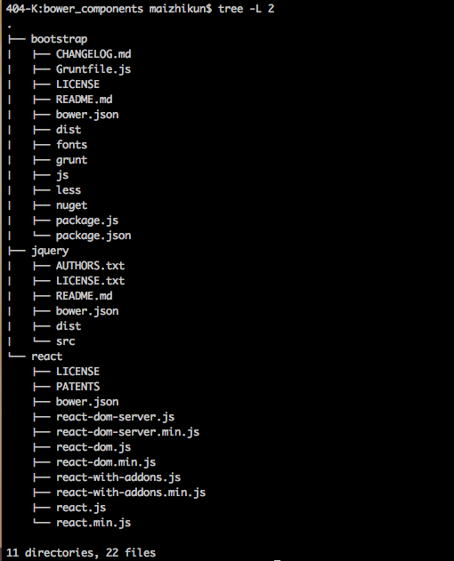

# 入门

##1. 学习源码

学习源代码<react-0.14.6_demo>;

#2. 学习视频

观看<http://tagtree.tv/thinking-in-react>视频学习

##2.1 配置环境

创建文件夹

    mkdir ttreact && cd $_
    
安装react文件

    $ bower install react
    $ bower install bootstrap
    
然后在当前文件夹就有个`bower_components`的文件夹包含如下目录结构

其实很简单.就是下载了react jquery bootstrap 在bower_components里而已

