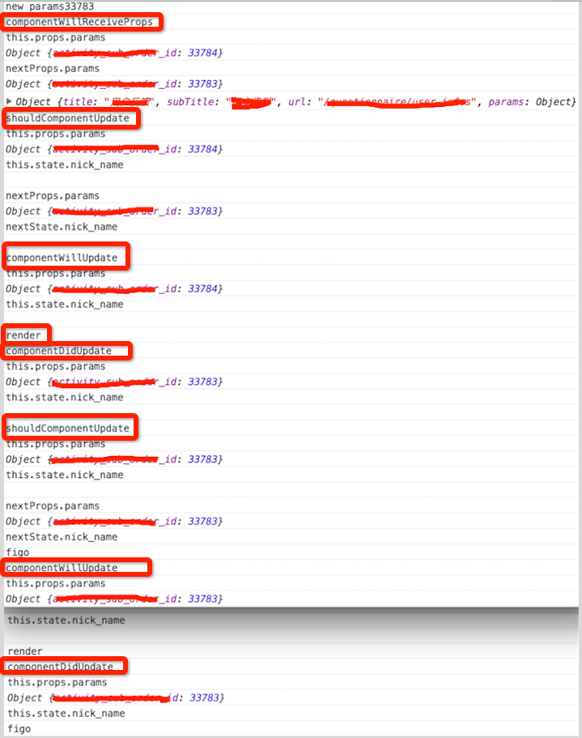

# React生命周期和props & state

## 1. 问题

我在`componentDidMount`中添加一个ajax请求,但是有一个刷新按钮,通过prpos传递给React一个id,React根据此id执行url刷新组件.

先看看一看React的生命周期图


(图片引自<http://www.race604.com/react-native-component-lifecycle/>)

在第一次加载React组件时,我通过componentDidMount里执行ajax来更新state,这里没有问题

关键是我点击了刷新,通过props传递给react一个id,然后根据id执行ajax刷新state.这时就出现当前props不是新传递进来的props引起的问题

## 2.Demo测试

先看看点击刷新后执行的传递id代码

```javascript
 console.log("new params" + index);
React_DOM.render(
    <Dialog
        params={{
            "id" : index,
        }}
        />,
    document.getElementById("example")
);
```

我在`componentWillReceiveProps`方法中调用了`this.getInfos(nextProps);`来更新state.

然后我在React中各调用方法输出了下当前和下一个的state & props

```javascript
        componentWillReceiveProps: function(nextProps){
            console.log("componentWillReceiveProps");
            console.log("this.props.params ");
            console.log(this.props.params);
            console.log("nextProps.params ");
            console.log(nextProps.params);
            this.getInfos(nextProps);
        },

        shouldComponentUpdate: function(nextProps,nextState) {
            console.log("shouldComponentUpdate");
            console.log("this.props.params ");
            console.log(this.props.params);
            console.log("this.state.nick_name ");
            console.log(this.state.nick_name);
            console.log("nextProps.params " );
            console.log(nextProps.params);
            console.log("nextState.nick_name ");
            console.log(nextState.nick_name);
            return true;
        },

        componentWillUpdate: function() {
            console.log("componentWillUpdate");
            console.log("this.props.params ");
            console.log(this.props.params);
            console.log("this.state.nick_name ");
            console.log(this.state.nick_name);
        },

        componentDidUpdate: function() {
            console.log("componentDidUpdate");
            console.log("this.props.params ");
            console.log(this.props.params);
            console.log("this.state.nick_name ");
            console.log(this.state.nick_name);
        },
```

发现是结果是这样的




## 3.结论
这些结果可以得出,只有在执行render时候或者`shouldComponentUpdate`返回false之后,新改变的props和state才会得到改变.

## 4. 解决方式

现在问题就来了

我新进来的props要在render或者`shouldComponentUpdate`返回false之后才会得到更新.

因为我的数据要通过ajax更新state的.

所以我的解决方式是 当如果判断如果只是props改变,则不继续执行,但是同时`componentWillReceiveProps`会发出ajax请求,ajax返回后更新state然后才执行render

解决代码

```javascript
componentWillReceiveProps: function(nextProps){
    this.getInfos(nextProps);//ajax请求
},

shouldComponentUpdate: function(nextProps,nextState) {
    if(nextProps != this.props){
        return false;
    }
    return true;
},

```
