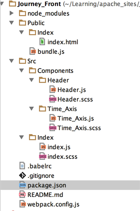
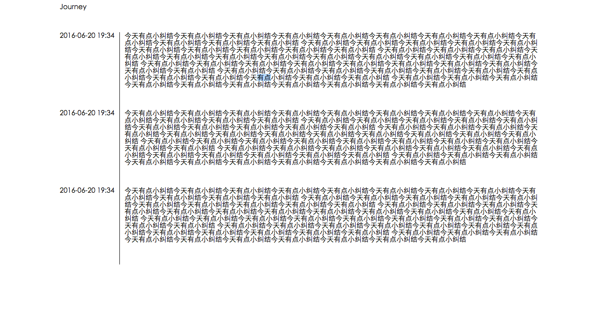

# 实现

> 2016-06-23

可以预览下初版<http://journey.404mzk.com/Index/> 

具体实现的技术有

1. React
2. webpack
3. flex

# 概括

目录如下



# 1. webpack

先说一下`package.json`,项目需要使用的依赖

主要分开发时依赖和运行时依赖

```javascript
  "dependencies": {
    "jquery": "3.0.0",
    "react": "15.1.0",
    "react-dom": "15.1.0",
  },
  "devDependencies": {
    "babel-core": "6.9.1", //babel核心库
    "babel-loader": "6.2.4", //webpack渲染babel
    "babel-preset-es2015": "6.9.0", //babel转es6
    "babel-preset-react": "6.5.0", //babel转react
    "css-loader": "0.23.1", //webpack加载css
    "html-loader": "0.4.3", //wepack加载html,其实这里作用不大,因为html已经写在react里了
    "node-sass": "3.8.0", //webpack渲染sass
    "sass-loader": "3.2.1", //webpack渲染sass
    "style-loader": "0.13.1", //webpack渲染css
    "webpack": "1.13.1" //webpack
  }
```

再来看看webpack配置

```javascript
module.exports = {
	entry: './Src/Index', //入口 webpack从这个js开始拓展找其他js
	output: {
		path: 'Public', //输出路径
		filename: 'bundle.js' //输出名称
	},
	module: {
		loaders: [
            {
                test: /\.js/, //后缀名为js
                loader: 'babel',通过babel-loader渲染
                include: __dirname + '/Src', //只渲染这个目录下的js
            },
            {
                test: /\.scss/, //后缀名为scss
                loaders: ['style','css','sass'],//通过style-loader、css-loader、sass-loader渲染
            },
            {
                test: /\.html/, //后缀名为html
                loader: 'html', //使用html-load渲染
            },
		],
	},
};
```

当然我现在只有一个页面,所以配置应该是最简单的

#2. Flex

初始版本截图



其实这里要是不用Flex,用传统的CSS很容易实现

例如 中间占80% 两边10%

```css
  margin: auto;
  width: 80%;
```

这里主要讲讲`Time_Axis`模块

html代码

```javascript
class Time_Axis extends Component {
    render() {
        return (
            <section className="time_axis">
                <article>
                    <time datatime="2016-06-20 19:34" className="time_axis_item_time">2016-06-20 19:34</time>
                    <section >
                        今天有点小纠结今天有点小纠结...
                    </section>
                </article>
                <article>
                    <time datatime="2016-06-20 19:34" className="time_axis_item_time">2016-06-20 19:34</time>
                    <section >
                        今天有点小纠结今天有点小纠结...
                    </section>
                </article>
                <article>
                    <time datatime="2016-06-20 19:34" className="time_axis_item_time">2016-06-20 19:34</time>
                    <section >
                        今天有点小纠结今天有点小纠结...
                    </section>
                </article>
            </section>
        )
    }
}

export default Time_Axis
```


# 参考

webpack入门: <https://cnodejs.org/topic/57528759adc77ac170409e79?hmsr=toutiao.io&utm_medium=toutiao.io&utm_source=toutiao.io>

flex参考:

<http://www.ruanyifeng.com/blog/2015/07/flex-grammar.html>

<http://www.ruanyifeng.com/blog/2015/07/flex-examples.html>

<https://developer.mozilla.org/zh-CN/docs/Web/CSS/CSS_Flexible_Box_Layout/Using_CSS_flexible_boxes>