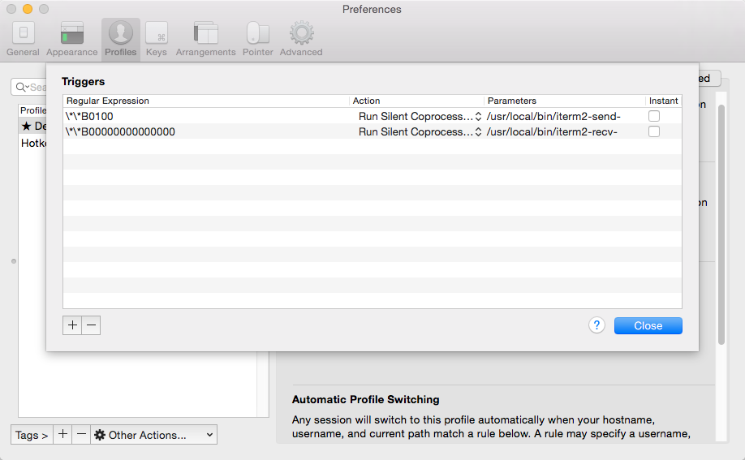

# 使用rz和sz

在Mac中给服务器 一般的ftp和scp可以完成任务,但是sz和rz也还ok

这里前提在item2中使用

```bash
cd /usr/local/bin

sudo wget https://raw.github.com/mmastrac/iterm2-zmodem/master/iterm2-send-zmodem.sh

sudo wget https://raw.github.com/mmastrac/iterm2-zmodem/master/iterm2-recv-zmodem.sh

sudo chmod 777 /usr/local/bin/iterm2-*
```

然后在item2->prefrences->profiles->Advanced->Edit添加上着两个命令



但是也有一个问题.我在rz了以后,弹出选择框以后,点击取消,会一直弹选择框......

# 参考

http://xfhnever.com/2015/09/04/mac-rzsz/