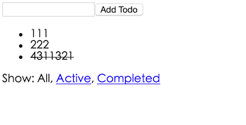

# Todos


# 0.本Demo来源

<https://github.com/reactjs/redux>

# 1. 功能解析

1. 添加todo
2. 点击todo,切换active|completed状态
3. 分类显示

# 2. 功能点解析

## 2.1 添加todo

添加todo的思路就是

点点击`Add Todo`时,当文本框不为空,即提交todo

瞄瞄代码

```javascript
let AddTodo = ({ dispatch}) => {
  let input

  return (
    <div>
      <form onSubmit={e => {
        e.preventDefault()
        if (!input.value.trim()) {
          return
        }
        dispatch(addTodo(input.value))
        input.value = ''
      }}>
        <input ref={node => {
          input = node
        }} />
        <button type="submit">
          Add Todo
        </button>
      </form>
    </div>
  )
}
AddTodo = connect()(AddTodo)

export default AddTodo
```

就是执行

1. `dispatch(addTodo(input.value))`;
2. `AddTodo = connect()(AddTodo)`: 将`AddTodo`组件里的dispath和Redux连接起来

`connect()(AppTodo)`的作用就是将AddTodo组件中的dispath交给Redux处理.

View层就就是发送这个通知,后面的事情就不得而知了.

这个文本框和提交按钮的任务就完成了,只负责提交内容,store里的变化与它无关

OK,但是这个addTodo(input.value)究竟咋执行啊

`addTodo`的实现方法放在action中.

```javascript
export const addTodo = (text) => {
  return {
    type: 'ADD_TODO',
    id: nextTodoId++,
    text
  }
}
```

啊..action就是定义了这些东西..action指定了动作的类型,和传输的数据.

恩.通过这里我知道增加一个todo,他的id是`nextTodoId++`,内容为text

然后呢?这就改变了传说中Redux的store了吗.啊.同志们别着急.

我们之前在view里写的是`dispatch(addTodo(input.value))`

所以要把这个addTodo返回的内容,通过dispath发送给Store啊.

啊Store里收到action给我返回的内容,我应该怎么改变自己的内容啊 T_T..

这里就是通过`reducer`拉.

```javascript
const todos = (state = [], action) => {
  switch (action.type) {
    case 'ADD_TODO':
      return [
        ...state,
        {
        id: action.id,
        text: action.text,
        completed: false
        }
      ]
    ...
    default:
      return state
  }
}
```

这里的`...state`是原先包含的`todos`啦,加上新来的嘛,这就是新的state

OK 我们已经提交todo到store啦.

但是我们在下面的ul中添加新的todo啊..咋设置它呢? 下面继续介绍这个功能点.

## 2. 显示todos

先说明todos要做的功能

1. 显示你当前筛选的类型todos

2. 点击todo,状态取反

这里有容器和显示组件的说明

|            | 容器组件              | 展示组件              |
|------------|-----------------------|-----------------------|
| 位置       | 最顶层，路由处理      | 中间和子组件          |
| 使用 Redux | 是                    | 否                    |
| 读取数据   | 从 Redux 获取 state   | 从 props 获取数据     |
| 修改数据   | 向 Redux 发起 actions | 从 props 调用回调函数 |


我们这里先定义容器组件,这里的容器组件,作用是筛选要显示的todo和设定dispath

```javascript

const getVisibleTodos = (todos, filter) => {

  switch (filter) {
    case 'SHOW_ALL':
      return todos
    case 'SHOW_COMPLETED':
      return todos.filter(t => t.completed)
    case 'SHOW_ACTIVE':
      return todos.filter(t => !t.completed)
  }
}

const mapStateToProps = (state) => {
  return {
    todos: getVisibleTodos(state.todos, state.visibilityFilter)
  }
}

const mapDispatchToProps = (dispatch) => {
  return {
    onTodoClick: (id) => {
      dispatch(toggleTodo(id))
    }
  }
}

const VisibleTodoList = connect(
  mapStateToProps,
  mapDispatchToProps
)(TodoList)

export default VisibleTodoList
```

这里主要设定了两个函数

1. mapStateToProps: 当store 发生改变，mapStateToProps 被调用。mapStateToProps必须返回一个纯对象，这个对象会与组件的 props 合并.
2. mapDispatchToProps: 返回一个Object|Function

    1. 返回Object: 对象里的函数都是Redux action creator,而且这个Object会与store绑定在一起,其定义的方法名作为属性名合并到组件的props中.
    2. 返回Function: 该函数会接受dispath函数,然后再由你决定如何返回一个对象,这个对象通过dispath与action creator绑定在一起.


真是发现上面说的都是鬼话..

就本例子来说

`mapStateToProps`返回了一个`todos`,这个todos就是ul中要显示的内容,但是在本容器中已经筛选好了.

凡是store发生了变化,`mapStateToProps`都会执行,所以这里可以解决我们在`1`最后提的问题可以解决.

当添加todo,如果在ul中及时更新

因为当添加新todo,store就会发生改变,这里就会触发`mapStateToProps`,`mapStateToProps`会重新帮我们筛选一遍要显示的todo

然后

`mapDispatchToProps`返回了一个`{onTodoClick}`,那就是返回一个对象咯.

按照上面的鬼意思说明,当返回的是Object,对象里的函数都是Redux action creator,而且这个Object会与store绑定在一起,其定义的方法名作为属性名合并到组件的props中.

OK,现在我们知道`{onTodoClick}`被绑定在store中,而`onTodoClick`被合并到props中.

喂~,Redux,你无聊么,这样搞干嘛...看官,别着急,接着看,该容器的最后一段函数

```javascript
const VisibleTodoList = connect(
  mapStateToProps,
  mapDispatchToProps
)(TodoList)
```

OK,这里就是包装容器啦,把之前定义的东西与Redux connect起来,并调用`TodoList`

大家有没有对这个容器有点想法,接下来这个`TodoList`要做的事情,已经在容器中做好了?

接下来`TodoList`只是`使用`这个筛选功能和状态取反功能.

看看`TodoList.js`

```javascript
const TodoList = ({ todos, onTodoClick }) => (
  <ul>
    {todos.map(todo =>
      <Todo
        key={todo.id}
        {...todo}
        onClick={() => onTodoClick(todo.id)}
      />

    )}
  </ul>
)
```

这里有几个解释的点

1. 参数`todos`和`onTodoClick`: 都是之前在容器中定义好的
2. key: React建议对每个循环的组件都加上key
3. `{...todo}`,就是把todo定义的所有东西,都赋值给当前的组件Todo
4. onClick: 就是调用容器定义好的方法而已.

接下来是`todo.js`,

```javascript
const Todo = ({ onClick, completed, text }) => (
  <li
    onClick={onClick}
    style={{
      textDecoration: completed ? 'line-through' : 'none'
    }}
  >
    {text}
  </li>
)
```

到这里,要显示View和Action Creator已经说完了,但是这里还有一个更新store的操作没说完

点击单个todo,状态取反,这也是要更改store的

这其实在容器定义的点击事情中

```javascript
const mapDispatchToProps = (dispatch) => {
  return {
    onTodoClick: (id) => {
      dispatch(toggleTodo(id))
    }
  }
}
```

看看action.js怎么玩的

```javascript
export const toggleTodo = (id) => {
  return {
    type: 'TOGGLE_TODO',
    id
  }
}
```

action主要传输与更改store相关的属性,供reducer选择怎么更改store

我们点击单个todo后,就会通过`dispatch(toggleTodo(id))`,把这个action传送到reducer辣..接着它自己玩吧..看看reducer是怎么实现该操作的

```javascript
case 'TOGGLE_TODO':
      return state.map(t =>
         if (t.id !== action.id) {
        return state
      }

      return Object.assign({}, t, {
        completed: !t.completed
      })
      )
```

额..就是这样..更改了state,接下来store更改后触发的UI更改就交给每个组件的`mapStateToProps`啦

## 3.分类显示

最下面可以选择标签,分类显示

思路很简单,store存储`filter`,因为在ul中已经定义了各filter应该显示啥了,所以这里只要更改store中`filter`的状态即可,剩下的自己组件各自玩各自的

还是先看看底部分类标签容器做了啥触发函数

```javascript
const mapStateToProps = (state, ownProps) => {
  return {
    active: ownProps.filter === state.visibilityFilter
  }
}

const mapDispatchToProps = (dispatch, ownProps) => {
  return {
    onClick: () => {
      dispatch(setVisibilityFilter(ownProps.filter))
    }
  }
}

const FilterLink = connect(
  mapStateToProps,
  mapDispatchToProps
)(Link)
```

OMG,这里定义的`mapStateToProps`和`mapDispatchToProps`都多了一个`ownProps`参数啊,,啥意思啊,,继续看看神一样的API..

1. `mapStateToProps`: 如果指定了该回调函数中的第二个参数 ownProps，则该参数的值为传递到组件的 props，而且只要组件接收到新的 props，mapStateToProps 也会被调用
2. `mapDispatchToProps`: 如果指定了该回调函数中第二个参数 ownProps，该参数的值为传递到组件的 props，而且只要组件接收到新 props，mapDispatchToProps 也会被调用

啥意思啊..没动啊T_T..继续结合本例说明下

先看看`mapStateToProps`: 

```javascript
const mapStateToProps = (state, ownProps) => {
  return {
    active: ownProps.filter === state.visibilityFilter
  }
}
```

返回的这个应该是当前标签正在选择哪个分类

看看标签原来的View`<FilterLink filter="SHOW_ALL">`

OK,这里就是判断本身的filter是否等于store中的filter,从而设置样式

至于改变当前store的状态,当然交给`mapDispatchToProps`

```javascript
const mapDispatchToProps = (dispatch, ownProps) => {
  return {
    onClick: () => {
      dispatch(setVisibilityFilter(ownProps.filter))
    }
  }
}
```

action也是简单的发送内容给reducer参考而已

```javascript
export const setVisibilityFilter = (filter) => {
  return {
    type: 'SET_VISIBILITY_FILTER',
    filter
  }
}
```

reducer就是改变store,更简单了..


```javascript
const visibilityFilter = (state = 'SHOW_ALL', action) => {
  switch (action.type) {
    case 'SET_VISIBILITY_FILTER':
      return action.filter
    default:
      return state
  }
}

```