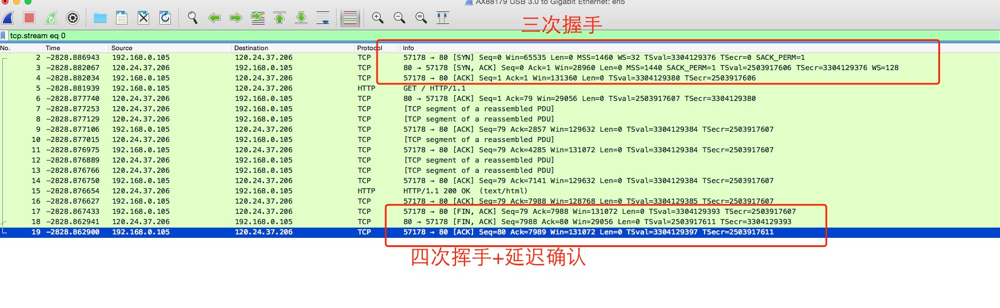

# tcp握手和挥手

# 三次握手和四次挥手wireshark显示

在命令行输入

```bash
curl http://www.404mzk.com
```

之后 就可以看到一个完整的握手和挥手



# 三次握手


# 四次挥手


有人疑问为什么经常抓包只抓到3次包

参考 https://blog.csdn.net/zqz_zqz/article/details/79548381

具体可见 RFC https://tools.ietf.org/html/rfc793#section-3.5


# 为什么要握手

客户端要与服务器进行交互数据


# 为什么握手是三次

为什么不是一次、两次

# 网上常见误区

# 四次挥手 抓包的结果有时候是三次 是因为延迟确认带来的结果(笔者认为此结论错误)


# 客户端如何知道要挥手

# 额外知识点

### 延迟确认(Delayed Ack)

有些文章说 四次挥手 用抓包只有3次挥手 实际是延迟确认的作用.

延迟确认的原理: 如果收到一个包之后暂时没有什么数据要发给对方, 那就延迟一段时间(window默认是200ms)再确认

假如在这段时间内恰好有数据要发送, 那确认信息和数据就可以在一个包发出去了

延迟确认并不一定带来性能提升 

但可以确认的是减少了部分确认包, 减轻了网络负担

参考 http://www.rfyy.net/archives/2679.html

# 待分析

- 延迟确认和Nagle算法 造成阻塞问题 https://cloud.tencent.com/developer/article/1004356

- KEEP-ALIVE 对 链接的影响

- 窗口大小的选择 

- 如何重发

- 2次MSL
