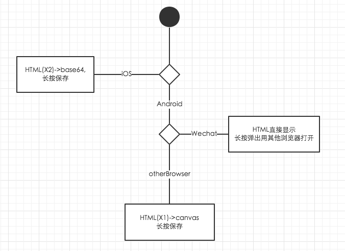
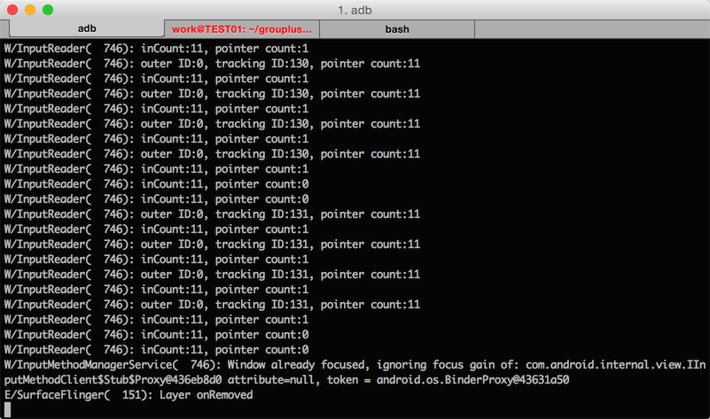
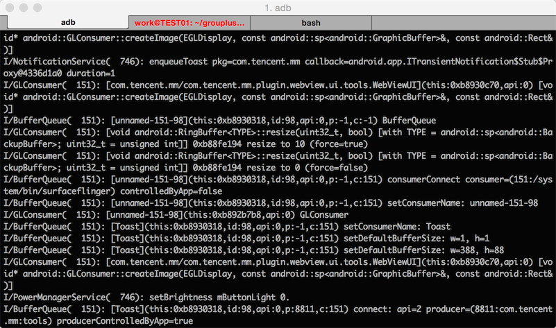

# 微信base64图片保存失败

## 1. 需求

报名成功后,通过后台ajax返回数据,生成一张邀请函

因为是报名成功的人都会生成一张邀请函,所以服务器生成图片不可靠,当n人同时报名,要同时生成n张邀请函,估计是服务会GG(其实是我不会服务器弄图片)

邀请函本来是通过另外一个下载按钮来自动下载的.

但是发现iOS在浏览器随便下文件..根本不现实(这个点也折腾了好久),最后跪着求产品,产品答应长按保存图片即可(当时我是很高兴的,后来发现还有很多坑..挨个跳,挨个填)

OK,所以最后思路定位,HTML->canvas->base64->img.src->长按保存

## 2. 解决思路

html由重构师,完成,其实`HTML->canvas->base64->img.src->长按保存`很容易实现

关键代码

```javascript
  //1. 引入html5canvas库
  html2canvas($('#share_html'), {
      onrendered: function(canvas) {
      var newImg = document.createElement('img');
          newImg.src =  URL.createObjectURL(canvas.toDataURL());
          var newbody = document.body.appendChild(newImg);
      }
});
```

这样在iOS基本能完成需求,但是发现这样生成的图片清晰度太低了.

因为Retina屏是x2的,所以根据原本的HTML生成canvas清晰度很低,

解决方式很粗暴,在Retina中生成的HTML为2倍,这样生成的图片像素OK

在android中按照原来的来就OK(如果也根据2倍生成,android机很容易失去响应)

但是android微信不支持长按保存base64图片,所以但android微信长按图片弹出用其他浏览器打开

最后思路基本这样



## 3. 弯路

从上面这样一看,好像还挺简单的,但是这个功能..折腾了我快一个星期...

先看看git..的各种尝试..


先列举下我整个星期的思路

1. 周三: 想通过原本设计的下载方式,点击按钮下载保存图片,尝试了3~4个小时后放弃.
2. 周四: canvas生成图片不清,最后方案为HTML改为2倍
3. 周五: 发现Android的Wechat保存图片失败,下面就开始各种高能,刚开始以为是没有img.src没有后缀名的原因,后来发现有些资源没有后缀,微信也能报错,所以排除这个想法.猜测应该是base64码微信无法保存的原因
4. 周六: 分辨是Android还是Wechat的锅

    但是我还是怀疑无法保存时Android还是Wechat的原因.用其他浏览器保存直接无响应,用Wechat显示保存失败,所以去看了看Android的log,`adb log`

    
    
       
   其实到这里,就能发现是Wechat的锅,原因:
    
    1. 第一张图是长按时,android给出的log,后面那张明显显示出微信`con.tencent.mm`报错了,而并没有Android的ERROR或者Warn
    
    2. 还有一个很明显就是谷歌搜`android browser long press save base64  image fail`之类的关键词,搜出来都是Android WebView中的类似问题,并没有我们所遇到的问题
       
       但是只要搜`微信 长按 保存 base64图片`,就会发现有很多苦逼的开发人员像我这样遇到这些问题,然而上面并没有解决方案
    3. 微信保存图片能显示保存图片失败,而其他浏览器直接奔溃,其实是因为微信压根没想下载这个图片,而其他浏览器本来想下载这图片的,太大了(原本拿HTML X2 400+KB来下载,X1 70+KB基本无这个问题),所以导致奔溃   