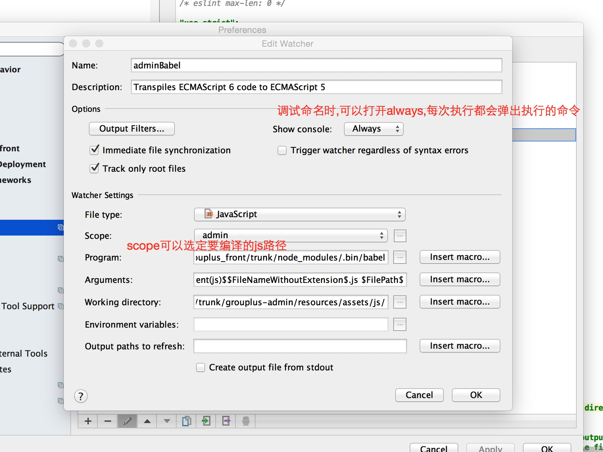

# PhpStrom支持Babel转JSX的步骤

## 1. npm支持

1. 安装babel : cd 到项目根目录,执行`sudo npm install --save-dev babel-cli`
2. 安装需要转换的语法包 : 
    1. `sudo npm install --save-dev babel-preset-es2015`
    2. `sudo npm install --save-dev babel-preset-react`
3. 创建babel读取的配置文件 : 在项目的根目录中新建`.babelrc`文件,内容为 : 

      ```xml
      {
        "presets" : [
            "es2015",
            "react"
        ],
        "plugins" : []
      }
      ```


## 2. PhpStorm设置

1. 支持JSX语法
    
    设置`PhpStorm->Preferences->Languages & Frameworks->JavaScript` , Javascript language version 选择`JSX Harmony`
    
2. 自动编译JSX    

    1. `PhpStorm->Preferences->Tools->File Watchers`点击加号,选择Babel
    2. 主要设置的地方有 : 
        1. `Program` : 选择npm install成功的babel命名, eg : `项目路径/node_modules/.bin/babel`
        2. `Arguments` : `指定源码路径 -d  指定输出路径` eg: `项目路径/resources/assets/js/ -d  项目路径/public/js`
        3. `Working directory` : 指定命令执行的路径,eg : `项目路径/resources/assets/js/`
    
## 3. 后续优化

看步骤2,其实可以很明显的发现`Arguments`明显不好,因为改变一个js,就要导致整个项目的js都重新编译一下,电脑要卡爆.

所以我们要优化下参数,要做到改变一个文件,只编译一个文件



在这里要注意下scope,要选择需要编译的js的文件夹

选择scope如下


大概步骤如下

1. 设置scope,指定要编译的路径
2. `Program`: 选择npm install成功的babel命名, eg : `项目路径/node_modules/.bin/babel`
3. `Arguments`: `--out-file 项目路径/public/js/requirejs-modules/grouplus-admin/$FileDirPathFromParent(js)$$FileNameWithoutExtension$.js $FilePath$` 指定编译后输出的地方和需要编译的文件
4. output paths to refresh: 清空

##4 File Watchers教程


## 参考资料

PhpStrom设置Babel <http://blog.jetbrains.com/webstorm/2015/05/ecmascript-6-in-webstorm-transpiling/>

Babel教程 <http://www.ruanyifeng.com/blog/2016/01/babel.html>