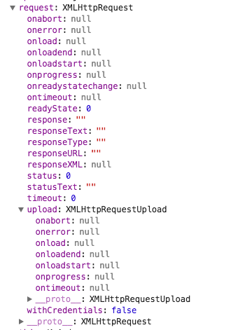

# XMLHttpRequest属性

# 简介

## 方法

按触发顺序

1. onreadystatechange: 一般情况下在整个请求回触发四次,对应的state分别是1(OPENED),2(HEADERS_ERCEIVED),3(LOADING),4(DONE),但是有些浏览器是不会触发1和2的,所以用的比较多的是4,(无论超时错误,timeout和成功都会把state变为4)
2. onloadstart: 在xhr.send()之后立即触发
3. onprogress: 一般每50ms触发一次,在HEADERS_ERCEIVED和LOADING过程中
4. onload: 请求完成(超时,错误,timeout不会触发此事件)
5. onabort: 仅当xhr.abort()后触发
6. ontimeout: 当超过设置timeout触发,但是会在改变readystatechange后触发,
7. onerror: (4xx,5xx,网络中断)都会触发,但(abort和timeout不会触发)
5. onloadend: 请求结束(包括成功,超时,错误,timeout等事件)

但出现abort timeout error时,

都会

1. 把readystate设置为4并触发onreadystatechange
2. 然后执行对应的onaobrt ontimeout onerror
3. 触发onloadend

# 参考资料

1. ajax比较详细的讲解: http://coderlt.coding.me/2016/11/20/js-ajax/
2. 属性说明: http://www.html5plus.org/doc/zh_cn/xhr.html