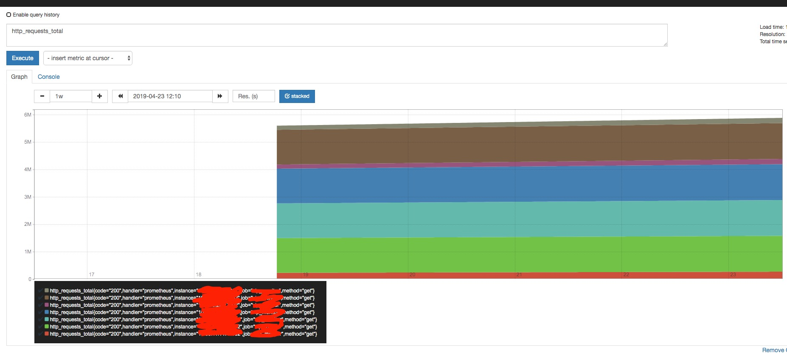

# prometheus+grafana监测系统

# prometheus 简单实例

> http_requests_total

简单的 只输入 http_requests_total 表示 统计 所有实时的量的请求



或者可以这样来增加筛选条件 表示http_requests_total这个数据集合里 只要 job为vip_monitor 而handle需要prometheus的

`http_requests_total{job="vip_monitor", handler="prometheus"}`

这样来增加时间的筛选 

`http_requests_total{job="vip_monitor", handler="prometheus"}[5m]`

这样的话就可以统计 这个是最近5分钟 的统计数据

但就无法用graph 而要要console才能跑通命令

筛选条件也可以用正则 遵守的是 https://github.com/google/re2/wiki/Syntax 正则实现

```
http_requests_total{job=~".*server"}
http_requests_total{status!~"4.."}
```

# 术语

|英文名|中文名|说明|
|--|--|--|
|Instant vector |瞬时向量|一组时间序列, 每个时间序列包含单个样本, 他们共享相同的时间戳, 也就是说, 表达式的返回值只会包含该时间序列中的最新一个样本, 而相对应这样的表达式称之为瞬时向量表达式|
|Range vector|区间向量|一组时间序列, 每个时间序列包含一段时间范围内的样本数据|
|Scalar|标量|一个浮点型的数据值|
|String|字符串|一个简单的字符串值|

Instant vector: 瞬时变量, 

# prometheus 基础语法

prometheus 专用的查询语句 称为 PromQL (Prometheus Query Language)

常用于 查询 实时的时序性数据

# prometheus 常用函数说明

> rate()

rate(表达式) 计算每秒平均增长率

# prometheus 内置变量

# 常见例子说明

需求: 求过去24小时内 vip_front_onload_duration 的和

> 方案一 increase函数

sum(increase(vip_front_onload_duration{pageid="pay.xxx.com/pay.html"} [24h]))

返回

{}  63,666,742.835976385

这里的sum函数是在 vip_front_onload_duration 有多个指标下用来聚合的 

> 方法二 _sum值

一般我们记录向量的时候 会多存一个_sum值

这里对应的向量名叫 vip_front_onload_duration_sum

vip_front_onload_duration_sum{pageid="pay.xxx.com/pay.html"} - vip_front_onload_duration_sum{pageid="pay.xxx.com/pay.html"} offset 24h

返回

{instance="10.33.11.147:7002",job="vip_monitor",pageid="pay.xxx.com/pay.html"}   178,070,325