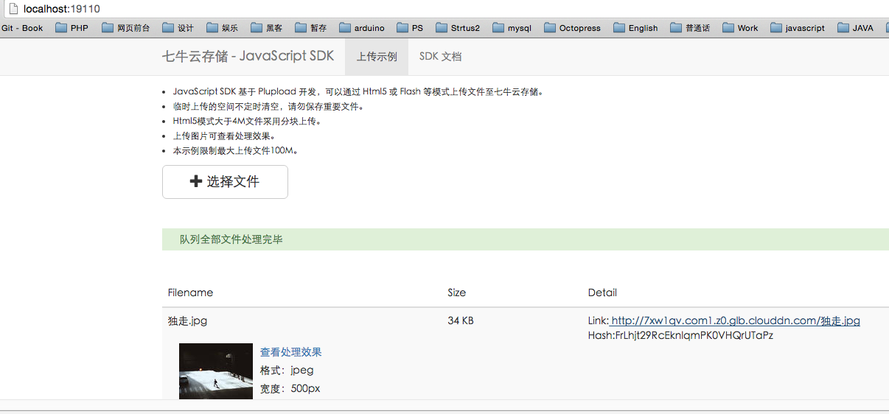

# 七牛

# 1. 运行DEMO

 1. `git clone git@github.com:qiniu/js-sdk.git`
 2. demo目录下复制并改名一份`confing.js`

    ```javascript
    module.exports = { 
        'ACCESS_KEY': '***', //公钥 
        'SECRET_KEY': '***',//密钥 
        'Bucket_Name': 'journey',//存储空间名称 
        'Port': 19110, 
        'Uptoken_Url': 'uptoken', 
        'Domain': 'http://7xw1qv.com1.z0.glb.clouddn.com/' //暂用的测试域名
};
    ```
 3. `make all`

运行结果:



然后就可以在七牛内容管理找到之前上传的图片啦.